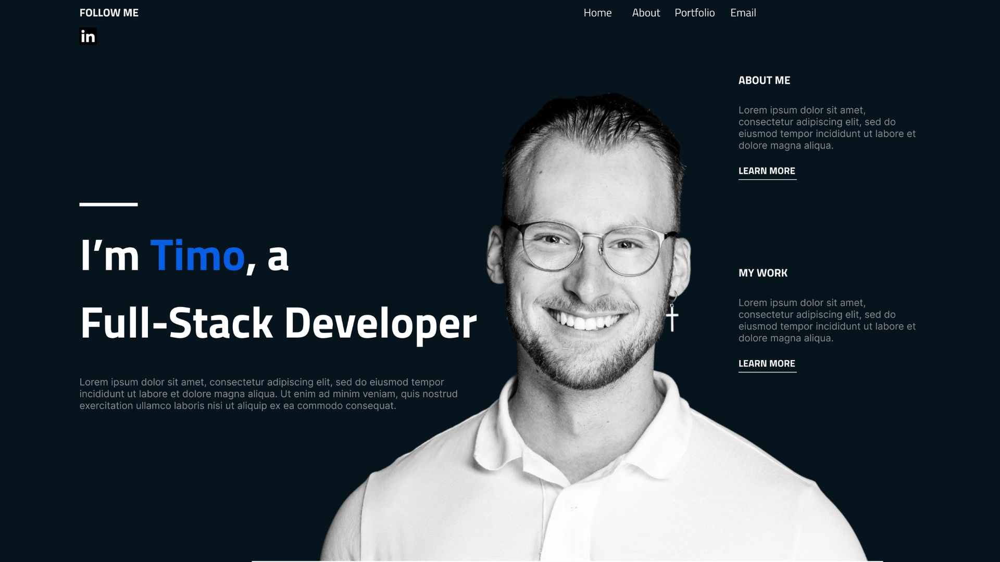

# `Portfolio Website`

Personal website with a minimalistic design showcasing the most up-to-date projects with their corresponding demos. Here, you'll be able to find my current projects, as well as the ones from the past couple of months.

## `Installing The Portfolio Website`

### `Step 1`

Download the code from the "portfolio-website" repo.

### `Step 2`

Run `npm install` to install all required dependencies.

### `Step 3`

Run `npm start` to launch the application. That's it!

Have fun!

## `Tech-Stack`

With this project, I decided to map out the mockup using [Figma](https://www.figma.com/file/oYhwdfRqaOYpqGfCGIlpd4/Personal-Website-Version-2?node-id=0%3A1&t=i58z6pnYReEv4C2o-0), created the actual code using React.js, CSS [SCSS], deployed it using Heroku and connected a custom domain to it from GoDaddy.

In the next couple of weeks I'll be changing out some of the JavaScript code to TypeScript, to make the code more clean and robust.

## `Let's connect`

I'd love to connect whether it be via email [hello@timohuennebeck.com](mailto:hello@timohuennebeck.com) or [LinkedIn](https://www.linkedin.com/in/timo-huennebeck/)!
